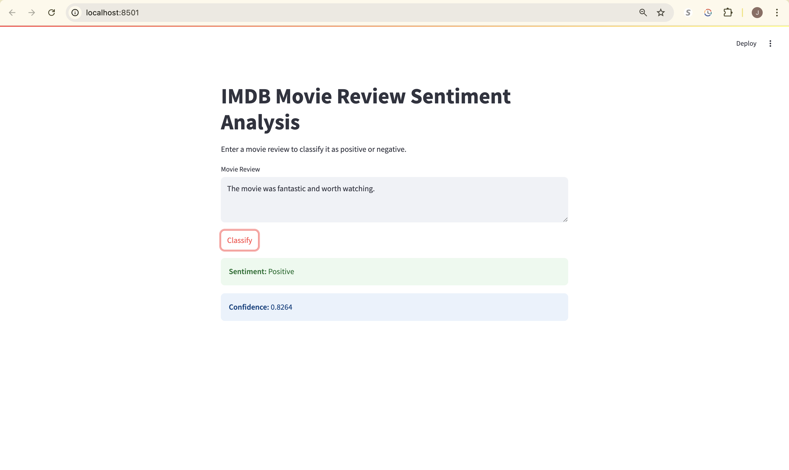

# IMDB Movie Review Sentiment Analyzer

**Powered by Simple RNN + Streamlit UI**

This project showcases a deep learning-based sentiment analysis tool built on the IMDB movie review dataset. It combines a custom-trained **Simple RNN** model with an intuitive **Streamlit** interface to classify reviews as **Positive** or **Negative**—in real-time!

## Live Demo with Streamlit

Run the app locally and get instant predictions!

```bash
streamlit run main.py
```



## Model Architecture

* Embedding layer for word vector representation
* SimpleRNN with ReLU activation
* Dense output layer with sigmoid for binary classification
* Trained using TensorFlow on the IMDB dataset with early stopping.

## Project Structure

```
├── main.py                # Application
├── simplernn.ipynb        # Model training using SimpleRNN
├── simple_rnn_imdb.h5     
├── prediction.ipynb       # Script to test sentiment prediction logic
├── embedding.ipynb        # Word embedding exploration
├── requirement.txt        
├── README.md              
```

## How It Works

1. Tokenizes the input review using the IMDB word index.
2. Pads the sequence to a max length of 500.
3. Feeds the input into the trained model.
4. Displays the **sentiment** and **confidence score** via the web app.

## Requirements

Install dependencies:

```bash
pip install -r requirement.txt
```

## Sample Review

```
Review: "This movie was fantastic! The acting was great and the plot was thrilling."
Sentiment: Positive
Confidence: 0.9453
```

## Built With

* [TensorFlow](https://www.tensorflow.org/)
* [Streamlit](https://streamlit.io/)
* [Keras IMDB Dataset](https://keras.io/api/datasets/imdb/)
